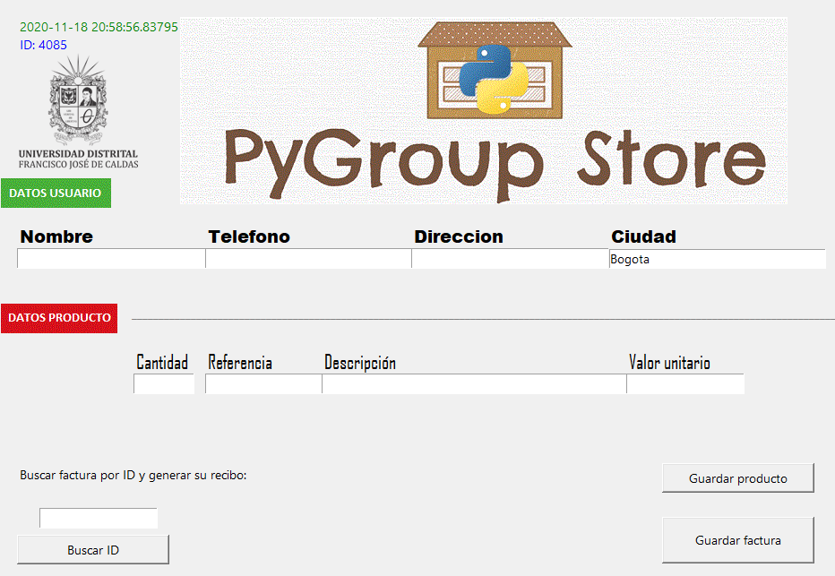

# PyGroup Store

_Proyecto para manejo de facturas y compras_

## Especificaciones

Proyecto realizado utilizando librerias para el manejo de excel e interfaz grafica en Python

### Pre-requisitos 📋

_Elementos necesarios_

```
Python 3.7
xlrd
xlwt
xlutils
```

Instalación de librerias python para el manejo de excel

```
pip install xlrd
pip install xlwt
pip install xlutils
```

## Interfaz de la aplicación ️



## Autores ✒️

* **David Ricardo Cortés Leal** - [dacorile](https://github.com/dacorile)
* **Juan Sebastián Sánchez Mancilla** - [ataches](https://github.com/Ataches)

_Aplicación creada a partir de auto aprendizaje y aplicando los conocimientos adquiridos en el curso de python del grupo de trabajo PyGroup de la Universidad Distrital_
